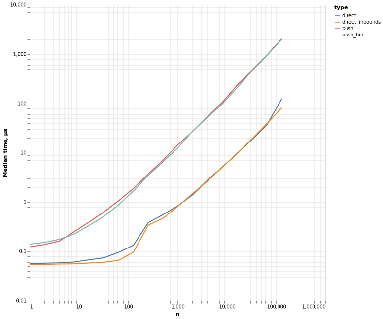
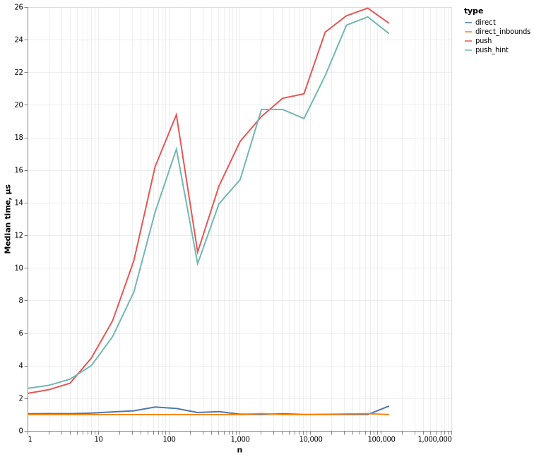
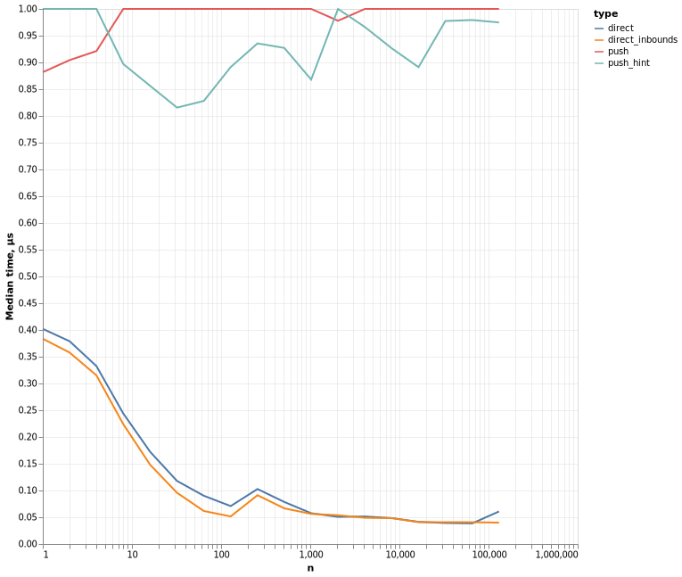
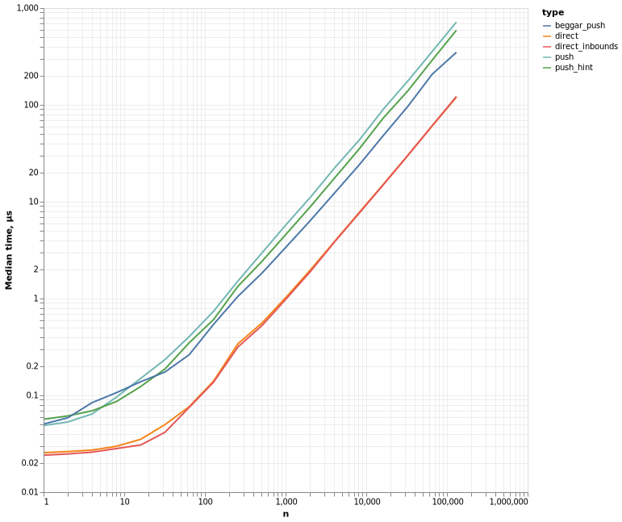
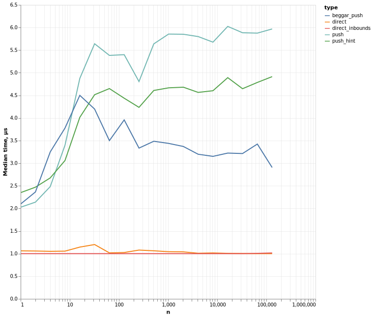
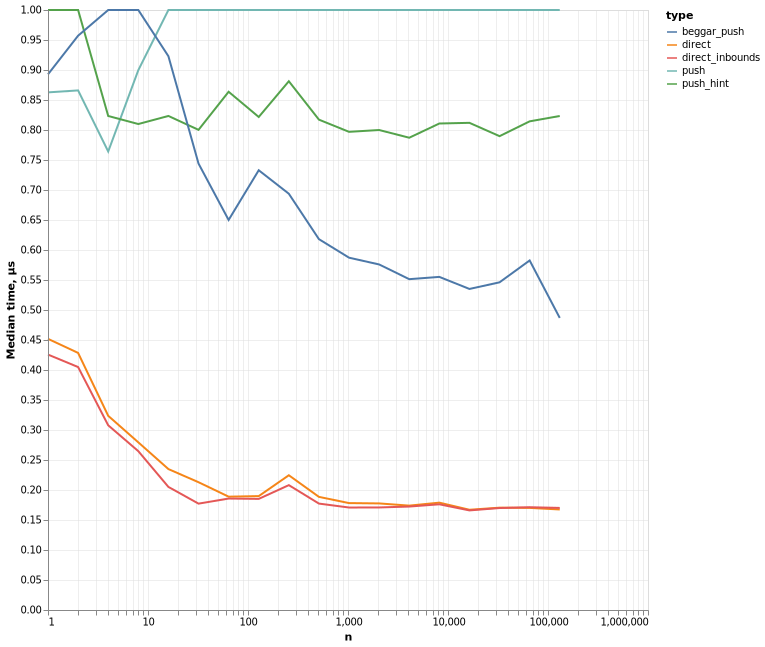

# PushDirectBenchmark

[](https://Arkoniak.github.io/PushDirectBenchmark.jl/stable)
[](https://Arkoniak.github.io/PushDirectBenchmark.jl/dev)
[](https://travis-ci.com/Arkoniak/PushDirectBenchmark.jl)
[](https://coveralls.io/github/Arkoniak/PushDirectBenchmark.jl?branch=master)

This is small benchmark package, which compares performance of different versions of array creation depending on the array size.

## Installation and usage

Package installation
```julia
julia> ] dev https://github.com/Arkoniak/PushDirectBenchmark.jl.git
```
Usage
```julia
using PushDirectBenchmark; plot_benchmarks()
```
will create files in `image` folder with Julia version info and benchmark plots. Include this plots in this README file in the same manner as it's done below.

Created files have form `<datetime>_<hostname>_<picturename>.png`, first two prefixes can be changed with the `name` argument
```julia
plot_benchmarks(name = "myname")
```
creates files in the form `myname_<picturename>.png`,
```julia
plot_benchmarks(name = name_helper("myname"))
```
creates files in the form `<datetime>_myname_<picturename>.png`. For consistency with
other results please use latter version.

## Benchmarks

### Arkoniak ubuntu vm

```julia
Julia Version 1.3.1
Commit 2d5741174c (2019-12-30 21:36 UTC)
Platform Info:
  OS: Linux (x86_64-pc-linux-gnu)
  CPU: Intel(R) Core(TM) i7-7700HQ CPU @ 2.80GHz
  WORD_SIZE: 64
  LIBM: libopenlibm
  LLVM: libLLVM-6.0.1 (ORCJIT, skylake)
Environment:
  JULIA_EDITOR = atom  -a
  JULIA_NUM_THREADS = 1
```

Performance


Performance relative to minimum benchmark time


Performance relative to maximum benchmark time


### Arkoniak home laptop

```julia
Julia Version 1.3.0
Commit 46ce4d7933 (2019-11-26 06:09 UTC)
Platform Info:
  OS: Linux (x86_64-pc-linux-gnu)
  CPU: Intel(R) Core(TM) i7-7700HQ CPU @ 2.80GHz
  WORD_SIZE: 64
  LIBM: libopenlibm
  LLVM: libLLVM-6.0.1 (ORCJIT, skylake)
```

Performance


Performance relative to minimum benchmark time


Performance relative to maximum benchmark time

